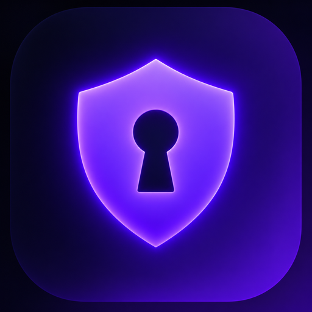
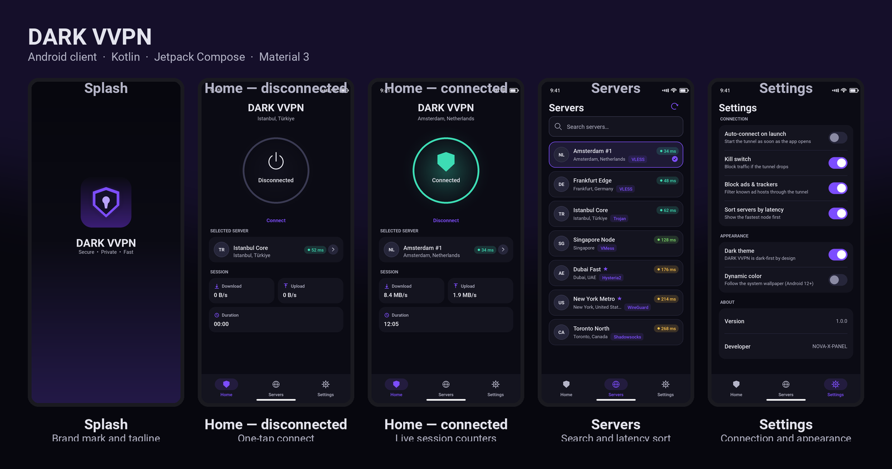
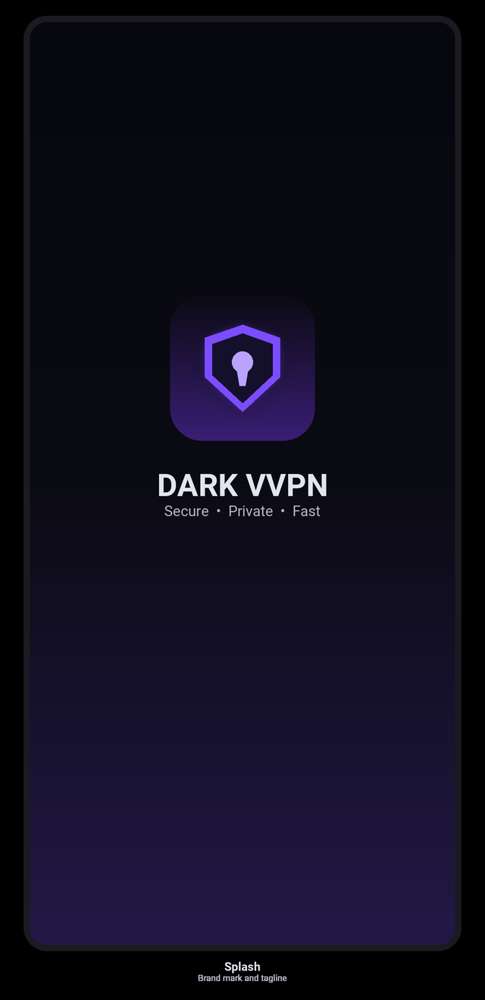
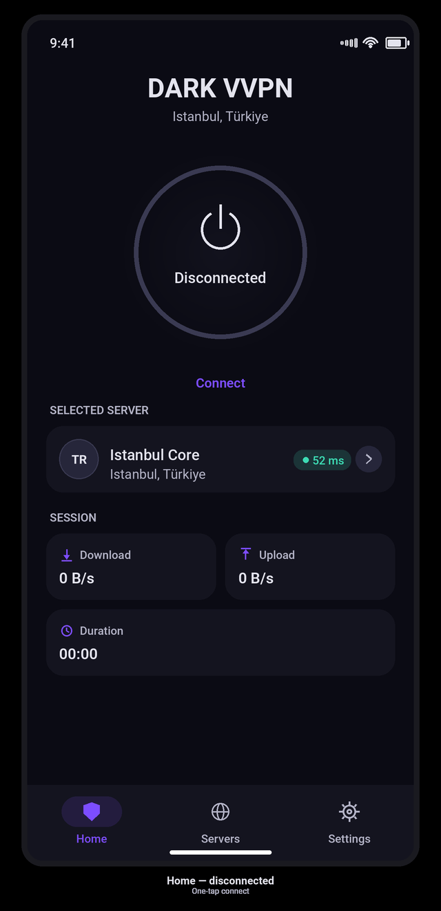
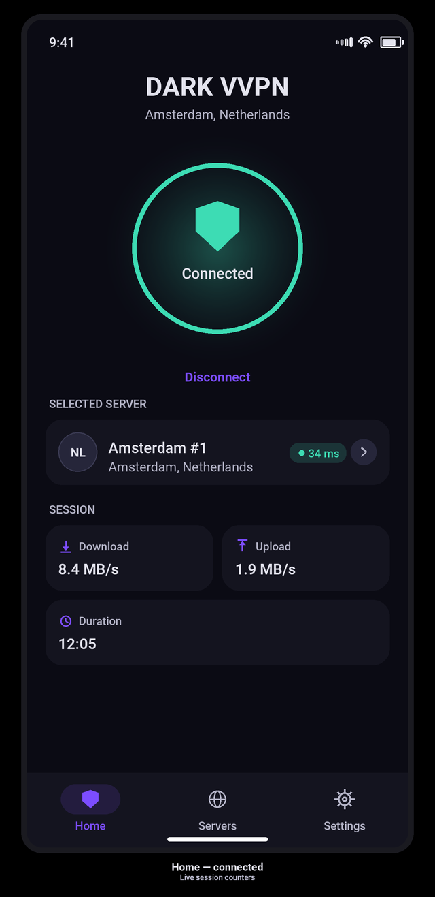
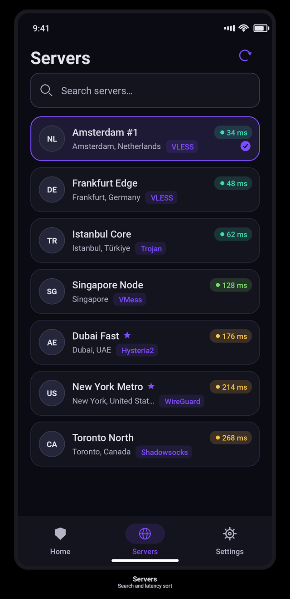
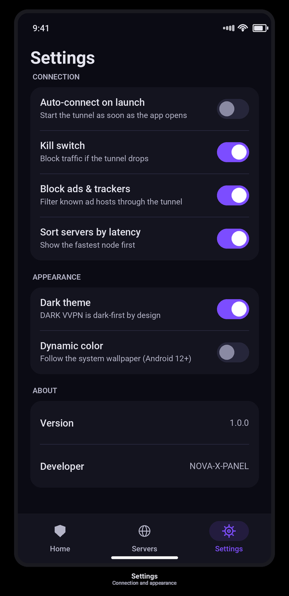

<div align="center">



# DARK VVPN

**A dark-first Android VPN client — Kotlin · Jetpack Compose · Material 3**

[](https://github.com/NOVA-X-PANEL/DARK-VVPN/actions/workflows/android.yml)
[](https://github.com/NOVA-X-PANEL/DARK-VVPN/releases/latest)


**[⬇ Download the latest APK](https://github.com/NOVA-X-PANEL/DARK-VVPN/releases/latest)** — debug build, ready to sideload.

</div>

---

## What this is

DARK VVPN is a **production-shaped client shell**: every part of the app that is
*not* the packet tunnel is finished. Navigation, theming, state management,
preference persistence, the `VpnService` lifecycle, the consent handshake and
the foreground notification all work as they would in a shipped app.

Node import, subscription refresh and config generation are done: a link from
any panel becomes an [`XrayConfigBuilder`](app/src/main/java/com/darkvvpn/app/xray/XrayConfigBuilder.kt)
outbound. The tunnel **data plane** — the loop that pumps packets between the tun
fd and the core — is deliberately left as a well-marked integration point so you
can drop in the core you actually use without rewriting the UI around it.

> **Status:** skeleton / reference implementation. It builds, runs and connects
> to a tun interface, but it does not yet forward packets. See
> [`docs/ARCHITECTURE.md`](docs/ARCHITECTURE.md) for exactly where the core
> attaches.

## Features

| | |
|---|---|
| **Every protocol** | VLESS, VMess, Trojan, Shadowsocks, WireGuard, SOCKS and HTTP, over TCP, WebSocket, gRPC, HTTP/2, HTTPUpgrade, SplitHTTP, XHTTP, QUIC and mKCP. |
| **Every security layer** | TLS, REALITY (publicKey / shortId / spiderX) and XTLS, with uTLS fingerprints, SNI, ALPN and `xtls-rprx-vision` flow. |
| **Subscription import** | Share links, base64 blobs, Clash YAML and sing-box JSON. A link can also be opened straight from another app. |
| **Subscription auto-update** | A configurable refresh interval, Wi-Fi-only option, per-subscription toggles, quota bar and last-error reporting. |
| **In-app updates** | Checks GitHub Releases, offers the new version, downloads it over HTTPS, **verifies the SHA-256** GitHub publishes, and hands it to the installer. |
| **Dark-first design** | A hand-tuned violet-on-ink palette, not a recoloured light theme. Material 3 throughout. |
| **One-tap connect** | An animated state-aware orb: pulsing ring while negotiating, green shield when up, red on failure. |
| **Full `VpnService` lifecycle** | Consent via `VpnService.prepare()`, foreground service with a live notification, correct teardown on revoke. |
| **Live session counters** | Download / upload throughput and session duration on the home screen. |
| **Credential hygiene** | A `Redact` helper, and backup rules that keep tokens out of logs and out of cloud backups. |
| **Tested** | 109 JVM unit tests covering the config builder, the subscription parser, version comparison and decoding edge cases. |

## Protocol and transport matrix

| Protocol | Xray outbound | Share link | Notes |
|---|---|---|---|
| VLESS | ✅ | `vless://` | REALITY, XTLS, `xtls-rprx-vision` |
| VMess | ✅ | `vmess://` | base64 JSON v2 and the legacy plain form |
| Trojan | ✅ | `trojan://` | TLS by definition |
| Shadowsocks | ✅ | `ss://` | SIP002 and the legacy whole-body base64 form |
| WireGuard | ✅ | `wireguard://` | native Xray outbound; keys, MTU, allowed IPs |
| SOCKS / HTTP | ✅ | `socks://`, `http://` | anonymous or user/pass |
| Hysteria2 | ❌ | `hysteria2://`, `hy2://` | QUIC-based; **needs a sing-box class core**. Parsed and stored, but reported as unsupported rather than mis-compiled |

Transport security: `none`, `tls`, `reality`, `xtls` · Transports: `tcp`, `raw`, `ws`,
`grpc`, `http`, `httpupgrade`, `splithttp`, `xhttp`, `quic`, `kcp`

A parsed node always becomes a `VpnServer`, and
[`XrayConfigBuilder`](app/src/main/java/com/darkvvpn/app/xray/XrayConfigBuilder.kt)
is the only place that knows Xray's schema — so a new input format never needs a
new config path, and a missing required field is reported by name instead of
surfacing as an opaque failure inside the core.


## Screens

<div align="center">



</div>

| | |
|---|---|
|  |  |
| **Splash** — brand mark and tagline | **Home** — one-tap connect |
|  |  |
| **Home, connected** — live session counters | **Servers** — search, latency sort, protocol badges |
|  | |
| **Settings** — connection, appearance and about | |

> These previews are rendered from the same design tokens the app uses
> (`ui/theme/Color.kt`, the type scale in `ui/theme/Type.kt`, and each screen's
> layout constants), so they reflect the shipped UI rather than a redesign of it.

```
┌─────────────┐  ┌─────────────┐  ┌─────────────┐
│   Splash    │  │    Home     │  │   Servers   │
│             │→ │             │  │             │
│   logo +    │  │  connect/   │  │  search +   │
│   tagline   │  │  disconnect │  │  node list  │
│             │  │    orb      │  │             │
│             │  │  + stats    │  │  + latency  │
└─────────────┘  └─────────────┘  └─────────────┘
                        │
                 ┌──────┴──────┐
                 │  Settings   │
                 │ connection/ │
                 │ appearance/ │
                 │   about     │
                 └─────────────┘
```

## Getting started

### Requirements

- Android Studio **Ladybug** (2024.2) or newer
- JDK **17**
- Android SDK with **compileSdk 35**
- A device or emulator running **Android 7.0 (API 24)** or newer

### Build from the command line

```bash
git clone https://github.com/NOVA-X-PANEL/DARK-VVPN.git
cd DARK-VVPN

# Debug build
./gradlew assembleDebug

# Install straight onto a connected device
./gradlew installDebug

# Unit tests
./gradlew testDebugUnitTest
```

The debug APK lands in `app/build/outputs/apk/debug/`.

### Build from Android Studio

`File → Open…` → select the repository root → let Gradle sync → press **Run**.

## Project structure

```
DARK-VVPN/
├── app/
│   └── src/
│       ├── main/
│       │   ├── java/com/darkvvpn/app/
│       │   │   ├── DarkVvpnApplication.kt    # service locator (AppContainer)
│       │   │   ├── MainActivity.kt           # edge-to-edge host + bottom nav
│       │   │   ├── data/
│       │   │   │   ├── model/                # VpnServer, VpnProtocol, Subscription…
│       │   │   │   ├── repository/           # ServerRepository, SettingsRepository
│       │   │   │   ├── subscription/         # parser, fetcher, GeoNaming, store
│       │   │   │   └── update/               # checker, downloader, installer, semver
│       │   │   ├── navigation/               # routes + NavHost
│       │   │   ├── ui/
│       │   │   │   ├── components/           # ConnectionOrb, ServerRow, UpdateDialog…
│       │   │   │   ├── screens/              # Splash, Home, Servers, Subs, Settings
│       │   │   │   └── theme/                # colour, type, MaterialTheme
│       │   │   ├── util/                     # Formatters, Redact, NetworkState
│       │   │   ├── viewmodel/                # four ViewModels + factories
│       │   │   ├── vpn/                      # DarkVvpnService, manager, notifications
│       │   │   └── xray/                     # XrayConfigBuilder
│       │   └── res/                          # strings, themes, icons, backup rules
│       ├── test/                             # JVM unit tests
│       └── androidTest/                      # instrumented tests
├── docs/ARCHITECTURE.md
├── gradle/libs.versions.toml                 # version catalogue
└── .github/workflows/android.yml             # CI: build + test + artifact
```

## Architecture in one paragraph

State flows in one direction: `VpnConnectionManager` (a process-wide singleton)
owns the tunnel state and counters, `DarkVvpnService` drives them, and the
ViewModels expose them to Compose as `StateFlow`s. Screens are stateless
functions that read from a ViewModel and emit events back. Repositories are the
only things that touch persistence, and the whole dependency graph is wired by
hand in `AppContainer` — no DI framework, because the graph is three objects
deep. The full write-up, including the state machine and the exact place your
tunnel core plugs in, is in [`docs/ARCHITECTURE.md`](docs/ARCHITECTURE.md).

## Adding your tunnel core

1. Implement the packet pump in `DarkVvpnService.startPumpLoop()` — it is
   already off the main thread, cancellable and passed the open tun fd.
2. Replace the synthetic numbers in `startStatsLoop()` with counters from the
   core's own accounting.
3. Feed the config from `XrayConfigBuilder.build(server).rendered` into the core.
4. Keep credentials out of plain `SharedPreferences`; use the Keystore-backed
   storage of your choice and log only through `Redact`.

## Roadmap

- [x] Xray config generation for every protocol and transport
- [x] Subscription import and scheduled refresh
- [x] In-app update with SHA-256 verification
- [ ] Real packet forwarding behind a pluggable core interface
- [ ] Per-app split tunnelling
- [ ] Real latency probes instead of the simulated ones
- [ ] Quick Settings tile and home-screen shortcuts
- [ ] Localisation (Persian, Arabic, Russian, Turkish, Chinese)
- [ ] Baseline-profile and macrobenchmark suites

## Contributing

Issues and pull requests are welcome. Please keep changes focused, run
`./gradlew testDebugUnitTest` before opening a PR, and match the existing
Compose/Material 3 conventions rather than introducing a second way to do
something the project already does.

## Security

Please do not open a public issue for a security problem. See
[`SECURITY.md`](SECURITY.md) for the private reporting channel.

## License

Released under the **GNU General Public License v3.0**. See [`LICENSE`](LICENSE).

---

<div dir="rtl">

## دربارهی این پروژه (فارسی)

**DARK VVPN** یک اپلیکیشن اندروید برای اتصال به VPN است که با **Kotlin** و
**Jetpack Compose** و بر پایهی **Material 3** نوشته شده. این پروژه یک
«اسکلت کامل و آمادهی توسعه» است: تمام بخشهای اپ — رابط کاربری، ناوبری،
تم تاریک اختصاصی، مدیریت وضعیت، ذخیرهی تنظیمات، چرخهی حیات سرویس VPN و
اعلان سیستمی — پیادهسازی شدهاند.

تنها بخشی که بهصورت عمدی ناتمام گذاشته شده، «انتقال واقعی بستههای شبکه»
است؛ محلی که باید هستهی تونل دلخواه شما (Xray، sing-box، WireGuard و …)
به آن وصل شود. محل دقیق اتصال در فایل `docs/ARCHITECTURE.md` مشخص شده است.

### ساختار کلی

- `ui/` — صفحهها و کامپوننتهای Compose
- `data/` — مدلها و مخزنهای داده
- `vpn/` — سرویس VPN و مدیر اتصال
- `viewmodel/` — مدیریت وضعیت هر صفحه
- `navigation/` — مسیرها و NavHost

### اجرای پروژه

```bash
git clone https://github.com/NOVA-X-PANEL/DARK-VVPN.git
cd DARK-VVPN
./gradlew assembleDebug
```

حداقل نیازمندی: Android 7.0 (API 24) و JDK 17.

</div>
